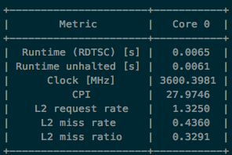
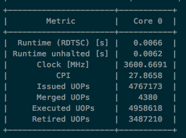
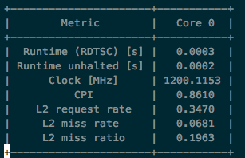
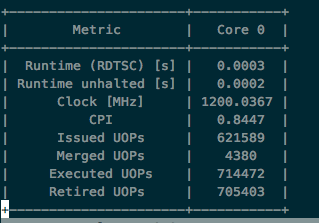

# Assignment 4


## Part 1: Superuseful application - GNU gprof

### 1. Why do the interesting functions kernel1 and kernel2 do not show up in the call graph when the Intel 17 compiler is used? Would you expect this behaviour from the documentation of the Intel 17 compiler?

The profiling doesn't seem to create a call graph at all.

```
gprof: gmon.out file is missing call-graph data
```

The [superMUC help page](https://www.lrz.de/services/compute/supermuc/tuning/gprof/) mentions that *-pg* has to be specified before *-03*, but still no call graph is created.

The [compiler documentation](https://software.intel.com/sites/default/files/managed/08/ac/PDF_CPP_Compiler_UG_17_0.pdf) mentions, that the profiling function isn't available on the Intel 64 architecture targeting the Xeon Phi coprocessor x100 product family (Knights Corner).  
Maybe this also includes the x200 family (Knights Landing).  

The Makefile looks like this:   
```
CXX=icpc
CXXFLAGS= -pg -O3 -xMIC-AVX512
LDFLAGS= -pg
DEFINES=
SOURCES=superuseful.cpp
OBJECTS=$(SOURCES:.cpp=.o)
EXECUTABLE=superuseful
```

The profile data can be found in the *ex1* folder (gprof-no-call-graph.txt)

### 2. Use compiler options such that kernel1 and kernel2 show up in the call graph. Is the resulting profile still useful?

When using the *-g* compiler flag (for debug information in .o file) and not using *-O3 -xMIC-AVX512*, a call graph is generated.
The program is not longer optimized for the Xeon Phi platform, which makes it run quite slowly. Before the execution time with profiling was around 20 seconds and now it is around 390 seconds.
Therefore the profile data doesn't seem too useful.

```
CXX=icpc
CXXFLAGS= -pg -g
LDFLAGS= -pg -g
DEFINES=
SOURCES=superuseful.cpp
OBJECTS=$(SOURCES:.cpp=.o)
EXECUTABLE=superuseful
```

The profile data can be found in the *ex1* folder (gprof-call-graph.txt)

### 3. Add compiler pragmas such that the kernel1 and kernel2 show up in the call graph but without incurring significant profiler overhead.

We weren't able to find information about this online.
After trying out different directives, for example "#pragma omp parallel for", we couldn't find any of the clauses that would reduce the profiler overhead.

### 4. Which function should be optimized first (according to the profile data)?

The profile data with the call graph suggests that 57.1% of the execution time is spent in kernel2, but it's also called a lot more than kernel1.  
Assuming it's always called way more often than kernel1 it would be good to optimize kernel2 first.  

If it wouldn't be set to about 80% kernel2 calls, it would probably be better to optimize kernel1 first, as it takes a little bit more time per call.  

kernel2: 158.69 sec / 7972 calls = 0.0198 sec per call  
kernel1: 51.44 sec / 2028 calls = 0.0253 sec per call

## Part 2: Quicksort - Intel VTune Amplifier XE

### 1. Find the optimal final-clause for your OpenMP parallelization of Quicksort using Intel VTune Amplifier XE.

We used 64 threads for this, because this is the number of physical cores. We compared final clauses based on array length and on recursion depth.  

For doing that we used the file *submit_job* which takes *NUM_THREADS*, *JOB_TYPE* and *THRESHOLD* as parameters and handles compilation and job submission.  
*JOB_TYPE* 0 is for array length and 1 is for recursion depth.

```
 "Usage: submit_job <OMP_THREADS> <JOB_TYPE=0(array_length)|1(recursion_level)> <THRESHOLD>"
```

The results suggest that a large part is due to "Spin Time" and more precisicely due to *Imbalance or Serial Spinning*, which means there may be load imbalance or insufficient concurrency.  
Also a lot of time is "Overhead Time" but most of it is categorized as "Other", which isn't really helpful.

The top hotspots are *__kmpc_barrier* and *__kmp_fork_barrier*.  
Both of them are connected to load imbalance or insufficient concurrency and it is suggested to try to increase task granularity.
So we tried doing that while trying to minimize those hotspots.

For a recursion level threshhold the optimal level appears to be 22.  
For that value the hotspots are the smallest and overall elapsed time is the lowest.

For length cut of the optimal length appears to be around 25000.  
But overall it seems that the recursion level cut off is a bit better.  

A few screenshots of the vtune programm can be found in the *ex2/images* folder.

### 2. Look at the other analysis types besides “Basic Hotspots”. Are they useful for the Quicksort application? What is the difference between them?

Advanced Hotspots: This type also identifies performance-critical code sections and correlates the data with the system performance.  
	For Quicksort it seems like the basic Hotspots are sufficient.
	
Then there are three types for profiling Parallelism:

Concurremcy: Visualizes thread parallelism on available cores, finds low or high concurrency areas and identifyies serial bottlenecks.  
	For a parallel program this seems useful, but the parallelism in Quicksort may be to simple to make this useful.
	
Locks and Waits: Helps locating causes of low concurrency, such as large critical sections and heavily used locks.  
	This isn't helpful for out Quicksort implementation because it doesn't jave locks or critical sections.
	
HPC Performance Characterization: Helps understanding how a compute-intensive OpenMP or MPI app is using the CPU, memory and FPU resources.  
	This doesn't seem useful for Quicksort.
	
There are also two types for Microarchitecture profiling:

General Exploration: Good for identifying the CPU pipeline stage and hardware units responsible for hardware bottlenecks.  
	This doesn't seem useful for Quicksort.
	
Memory Access: Good for memory-bound apps, helps determining which level of memory hierarchy is impacting performancy by revieving CPU cache and main memory usage.  
	This doesn't seem useful for Quicksort.
	
### 3. Does the optimal final clause depend on the number of threads or the array length?

In our case the best performance was achieved with a recursion level cut off.
Therefore our optimal clause depends on the number of threads.
The optimal cut off for our implementation is at recursion level 22.

## Part 3: CG - Scalasca

## Part 4: Likwid-perfctr

### 1. The file game.cpp could be part of a physics engine for a computer game. As in classic object oriented programming styles, it creates a heap-allocated object for every rigid body. Here, we want to analyse its performance characteristics using LIKWID.

#### a. Using the marker API of LIKWID allows the measuring of specific code regions. Introduce a marker for the gravity function. What do you need to do in order for the markers to work (compilation options, command line arguments)?

To introduce a marker the cpp file needs to be modified.
*likwid.h* needs to be included and the marker needs to be added.

```c
  ...

  LIKWID_MARKER_INIT;
  LIKWID_MARKER_THREADINIT;
  
  for (int t = 0; t < T; ++t) {
    gravity(0.001, bodies, N);
  }

  LIKWID_MARKER_CLOSE;
  
  ...
```

```c
void gravity(double dt, RigidBody** bodies, int N) {
  LIKWID_MARKER_START("gravity");
  for (int n = 0; n < N; ++n) {
    bodies[n]->move(0.0, 0.0, 0.5 * 9.81 * dt * dt);
  }
  LIKWID_MARKER_STOP("gravity");
}
```

The code has to be linked against the LIKWID library and Pthreads needs to be enabled during linking.
The modified Makefile looks like this:

```
LIKWID_INCLUDE=/lrz/sys/tools/likwid/likwid-4.1/bin/../include/
LIKWID_LIB=/lrz/sys/tools/likwid/likwid-4.1/bin/../lib/

LIKWID_FLAGS = -DLIKWID_PERFMON -L$(LIKWID_LIB) -I$(LIKWID_INCLUDE) -llikwid

CXX=icpc
CXXFLAGS=-O3 -xHost -pthread $(LIKWID_FLAGS)
LDFLAGS=-lrt  $(LIKWID_FLAGS)
...
```

The command to run likwid-perfctr for a serial application with the marker API enabled in an interactive shell on the cluster looks like this:

*srun likwid-perfctr -C S0:0 -g groupname -o out.txt -m EXEC*

#### b.  Use *likwid-perfctr -a* to get a list of all available event groups. Which event groups are relevant for this kind of application and which are not? Give a brief explanation for every event group.

| Group Name  	| Description                                                                                                                                                                             	|
|-------------	|-----------------------------------------------------------------------------------------------------------------------------------------------------------------------------------------	|
| BRANCH      	| Branch prediction miss rate/ratio; How often a branch or a mispredicted branch occured per instruction retired in total; relevant                                                       	|
| CACHES      	| Cache bandwidth in MBytes/s; Measures cache transfers between L1 and Memory; relevant                                                                                                   	|
| CBOX        	| CBOX related data and metrics, CBOXes mediate traffic from L2 cache to the segmented L3 cache; Each CBOX is responsible for one segment (2.5 MByte); not relevant (serial application)  	|
| CLOCK       	| Power and Energy consumption; Monitors the consumed energy on the package level with RAPL interface; relevant if going for energy-awareness (but also implemented in ENERGY)            	|
| DATA        	| Load to store ratio; not really relevant                                                                                                                                                	|
| ENERGY      	| Power and Energy consumption; Monitors the consumed energy on the package level and DRAM LEVEL with RAPL interface; relevant if going for energy-awareness                              	|
| FALSE_SHARE 	| Measures L3 traffic induced by false-sharing; relevant                                                                                                                                  	|
| FLOPS_AVX   	| Packed AVX MFLOP/s; Approximate counts of AVX & AVX2 256-bit instructions; relevant                                                                                                     	|
| HA          	| Main memory bandwidth in MBytes/s seen from Home agent (central unit that is responsible for the protocol side of memory interactions); not really relevant (not many memory transfers) 	|
| ICACHE      	| L1 instruction cache metrics; relevant                                                                                                                                                  	|
| L2          	| L2 cache bandwidth in MBytes/s; relevant                                                                                                                                                	|
| L2CACHE     	| L2 cache miss rate/ratio; relevant                                                                                                                                                      	|
| L3          	| L3 cache bandwidth in MBytes/s; relevant                                                                                                                                                	|
| L3CACHE     	| L3 cache miss rate/ratio; relevant                                                                                                                                                      	|
| MEM         	| Main memory bandwidth in MBytes/s; Same metrics as HA group; not really relevant (not many memory transfers)                                                                            	|
| NUMA        	| Local and remote memory accesses; not relevant (serial application)                                                                                                                     	|
| QPI         	| QPI Link Layer data; not relevant (serial application)                                                                                                                                  	|
| RECOVERY    	| Recovery duration after SSE exceptions, memory disambiguations, etc; not relevant                                                                                                       	|
| SBOX        	| Ring Transfer bandwidth between the socket local ring(s); not relevant (serial application)                                                                                             	|
| TLB_DATA    	| L2 data TLB miss rate/ratio; relevant                                                                                                                                                   	|
| TLB_INSTR   	| L1 Instruction TLB miss rate/ratio; relevant                                                                                                                                            	|
| UOPS        	| UOPs execution info; Measures issued, executed and retired uOPS; relevant                                                                                                               	|
| UOPS_EXEC   	| Ratios of used and unused cycles regarding the execution stage in the pipeline; relevant                                                                                                	|
| UOPS_ISSUE  	| Like EXEC, but issue stage; relevant                                                                                                                                                    	|
| UOPS_RETIRE 	| Retire stage; relevant                                                                                                                                                                  	|

#### c. Run the application and measure relevant event groups. What would be your suggestions for improving the performance of the application?

Results for even loop runs can be found in the folder `ex4/game_results`. For our performance two numbers are interesting. The event group L2Cache and UOPS. We notice a lot of L2 cache misses which are about 33% of all L2 accesses. For micro operations we notice a large number of ops as well as a significant difference between the retired microops (ops that were actually useful) vs the executed ops (including some discarded ops). These situations are listed in the figures below.

||
|:--:| 
|*L2Cache*|

||
|:--:| 
|*UOPS*|

Upon analysis we figure out the following code fragment that is used.
```C++
RigidBody** bodies = new RigidBody*[N];
for (int i = 0; i < N; ++i) {
  bodies[i] = new RigidBody[i];
}
// ...
// Some other stuff and then when we access these bodies it looks like
for (int n = 0; n < N; ++n) {
  bodies[n]->move(0.0, 0.0, 0.5 * 9.81 * dt * dt);
}
```

We allocate a contiguous array of pointers but each object is allocated memory non contiguously. As a result even though we access them one after another there are a lot of cache misses. To fix this we can try to allocate a contiguous array instead of an array of pointers.
```C++
RigidBody* bodies = new RigidBody[N];
```
This helps improve the cache hit hate for L2 (which is responsible for storing the array) and by reducing the numbing of micro ops as we reduce the number of load store operations due to cache misses. After fixing this the results for the two event groups are illustrated below.

||
|:--:| 
|*L2Cache after improvement*|

||
|:--:| 
|*UOPS after improvement*|

It can be seen that the cache miss ratio, the number of micro ops and the difference between executed versus retired micro ops all go down.

### 2. The file dtrmv.cpp contains a routine for upper-triangular matrix times vector multiplication. We want to investigate possible load imbalances, as the routine does not scale well to multiple cores.

#### a. Calculate the number of flops for every core manually and explain the load imbalance

Flops for upper-triangular matrix * vector are $$O(2*(\sum_{i=0}^{N} N-i))$$

One *Intel Xeon E5-2697 v3* has 14 cores. 

Total number of flops: 100010000 flops  

Calculating the Number of flops for 14 threads in dtrmv function:

The outer loop is divided equally:

*#pragma omp parallel for*  
*for (int i = 0; i < N; ++i)*

10000/14 = 714 R:4

4 cores execute 715 loop runs, 10 execute 714 loop runs.

Core 0 executes loop runs i=0 to i=714  
Core 1: 715 to 1429  
Core 2: 1430 to 2144  
Core 3: 2145 to 2859  
Core 4: 2860 to 3573  
Core 5: 3574 to 4287  
Core 6: 4288 to 5001  
Core 7: 5002 to 5715  
Core 8: 5716 to 6429  
Core 9: 6420 to 7143  
Core 10: 7144 to 7857  
Core 11: 7858 to 8571  
Core 12: 8572 to 9285  
Core 13: 9286 to 9999  

Then we can calculate the number of flops per core using $$O(2*(\sum_{i=start}^{end} N-i))$$

For Core 0:
$$2*(\sum_{i=0}^{714} 10000-i)= 2 * 6894745 = 13789490 flops$$

Core 0: 13789490 flops  
Core 1: 12767040 flops  
Core 2: 11744590 flops  
Core 3: 10722140 flops  
Core 4: 9686838 flops  
Core 5: 8667246 flops  
Core 6: 7647654 flops  
Core 7: 6628062 flops  
Core 8: 5608470 flops  
Core 9: 4660388 flops  
Core 10: 3569286 flops  
Core 11: 2549694 flops  
Core 12: 1530102 flops  
Core 13: 510510 flops  

Because the matrix is upper-triangular every chunk has a different number of flops using the default static scheduler. So every core has to execute less flops than the previous one even though the chunk size is the same.
This means that core 13 is most likely finished a long time before core 0 is.
This is the load imbalance.

#### b. Instead of hand calculation, it would be convenient to use hardware counters for the number of flops. However, these are known to be inexact since Sandy Bridge. Insert a marker for the dtrmv routine and measure the number of flops using LIKWID. Repeat the measurement for different numbers of threads. Are the measurements useful to find the load imbalance?

The Haswell architecture has no Events to measure FLOPS directly, only AVX_INSTS events. These count AVX & AVX2 256-bit instructions.  
The *FLOPS_AVX* group uses the *AVX_INSTS_CALC* event to calculate MFLOP/s.  

```
Packed SP MFLOP/s = 1.0E-06*(AVX_INSTS_CALC*8)/runtime  
Packed DP MFLOP/s = 1.0E-06*(AVX_INSTS_CALC*4)/runtime  
```

Multiplying *AVX_INSTS_CALC* by 4 and 8 gives an approximation of SP and DP instructions.  
The results of the measurements can be found in the *ex4/dtrmv-results* folder.  
In the application the dtrmv function is executed 10 times, therefore the counted AVX instructions have to be devided by 10 to get the number of instructions. For all tested number of threads the AVX instruction count then was around 12692000.  
Assuming DP this would be 50768000 instructions.  
Even though the number is off from what we calculated, the number of AVX instructions per core shows the load imbalance.  
Every core executes a different amount of AVX instructions.  

For 14 cores the highest count is 17373490 and the lowest is 770110. This is a similar ratio as for the manually calculated flops.  

#### c. Is *INSTR_RETIRED_ANY* a useful alternative?

*INSTR_RETIRED_ANY* counts all the instructions that are completed and needed for the applications (disregarding extra instructions executed due to *speculative execution*).  
The count for *INSTR_RETIRED_ANY* varyies greatly for different numbers of threads. The count becomes larger for more threads.  
This doesn't seem like a good alternative for counting the number of flops. Especially considering that *AVX_INSTS_CALC* doesn't really vary for different numbers of threads.  

#### d. Modify the program such that the load is approximately balanced.

*omp parallel for* uses a *static* schedule by default that assigns equally sized chunks to the different threads.  
Possibilites for improving the load balancing are using a *dynamic* schedule, a *guided* schedule or a *static* schedule with a fixed smaller chunk size.  
The dynamic schedule assigns chunks of iterations with a specified size to threads and when a thread is done executing it requests another chunks.  
This comes with some overhead.  
In the guided schedule the assigned block sizes are relatively large and become smaller until they reach a specified size (or 1 if nothing is specified).  
This usually requires less overhead than dynamic scheduling.  
Because the workload between iterations is monotonically decreasing in this case, using a static schedule with a relatively low chunk size may improve load balancing enough while avoiding the overheads for dynamic or guided scheduling.  

Dynamic scheduling seems to improve load balancing. For a chunk size of 500, the load is relatively balanced but the execution time is slower (14-dynamic-500.txt). For a chunk size of 100 half of the threads execute aroung 12000000 AVX instruction and the other half around 5000000, but the execution time is faster than for the default static scheduling (14-dynamic-100.txt).  

Guided scheduling with a minimal chunk size of 100 provides slightly better load balancing than the dynamic scheduling with an ececution time slightly faster than the default scheduling (14-guided-100.txt).  

Static scheduling with a chunk size of 5 pretty much achieves perfect load balancing and the execution time seems to be faster than with the default scheduling (14-static-5.txt). Therefore we decided to test this for different numbers of threads.  

The results can be seen in static-1.txt to static-28.txt.  
Overall, the loads seem to be pretty much balanced and the execution times are a bit lower than for the non-balanced version.

```c
void dtrmv(double const* A, double const* x, double* y) {
 #pragma omp parallel
 {
  LIKWID_MARKER_START("dtrmv");
  //#pragma omp for schedule(dynamic,100)
  //#pragma omp for schedule(guided,100)
  #pragma omp for schedule(static,5)
  for (int i = 0; i < N; ++i) {
    double sum = 0.0;
    for (int j = i; j < N; ++j) {
      sum += A[i*N + j] * x[j];
    }
    y[i] = sum;
  }
  LIKWID_MARKER_STOP("dtrmv");
 }
} 
```
